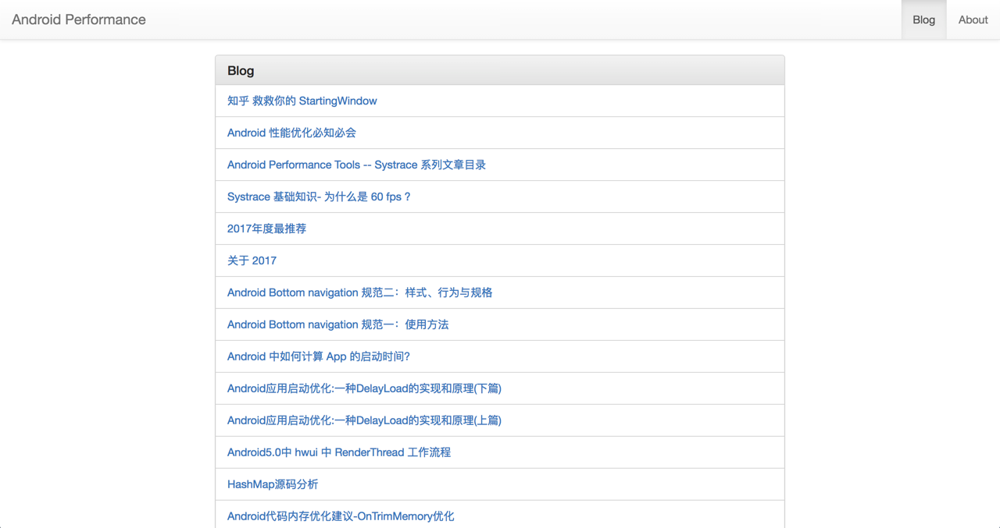
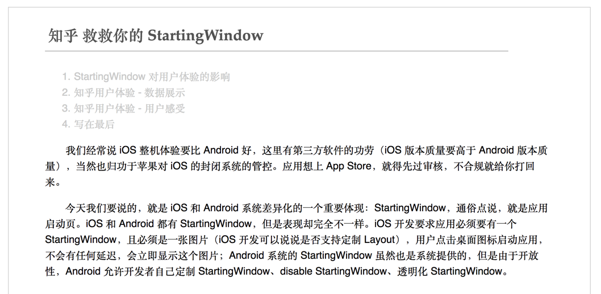

# hexo-theme-reading
Blog Theme For Hexo http://www.androidperformance.com/

## 主题说明
由于非常喜欢王垠博客的风格，所以四处找了一下发现已经有人做了这个博客的模板：https://github.com/mickeyouyou/yinwang，
非常感谢这位作者，但是由于作者很久没有更新，导致有一些小问题，比如移动端的适配问题等。
所以我重新开了个 git，来对目前存在的问题进行修改，同时也是自学的一个过程，目前这个主题还很简单，鄙人水平有限，功能会慢慢加。

首页预览图


文章页预览图


## NEW

新增 Tomorrow Theme 作为代码高亮，共有5款主题供你选择。默认使用 白色的 `normal` 主题，可选的值有 `normal`，`night`， `night blue`， `night bright`， `night eighties`：

## Install

```sh
$ git clone git@github.com:Gracker/hexo-theme-reading.git themes/reading
```


## Enable

Modify `theme` setting in `_config.yml` to `reading`.

##### You need Update `themes/reading/_config.yml`
- menu
- favicon.ico on `themes/reading/sourse/favicon`
- disqus id
- and so on...
- highlight theme


## Update


```
cd themes/reading
git pull
```
